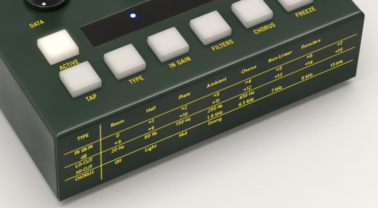
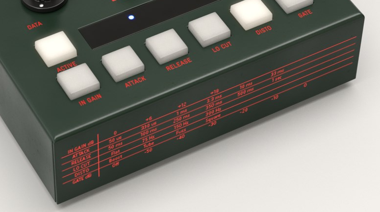
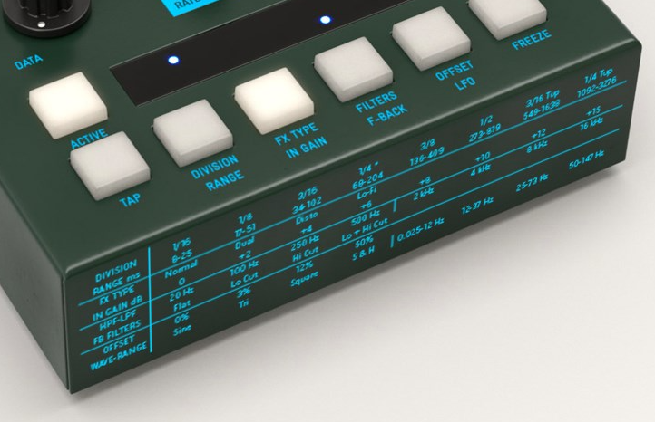

# 🎛️ OTO FX Reference Stickers

A collection of printable reference stickers for OTO Machines effects processors that display parameter settings in a compact format designed to fit on the side panel of each unit.

## ✨ Currently Available

- **BAM** 🔊 (Reverb) - *First revision (140mm x 38mm, v1.6 parameters). Subject to change.*
- **BOUM** 💥 (Compressor/Distortion) - Coming soon
- **BIM** ⏳ (Delay) - Coming soon

## 🌟 Features

- 📋 Complete parameter references for latest firmware
- 🏷️ All available settings clearly labeled
- 🎹 Organized for quick reference during performance or studio use
- 📐 Designed for side panel mounting
- 💡 **Tip:** Print onto sticker paper, apply to a magnet sheet, and custom cut for easy, non-permanent attachment to the case.

## 📊 Parameter Table

The following table shows the parameters included on the stickers (source data available in `OTO MACHINES.xlsx`). **Note:** This table assumes the latest firmware is installed on all units.

## 🎨 Design Details

### Color Scheme

| Element    | Description                   | HEX Code  |
| :--------- | :---------------------------- | :-------- |
| Background | Chassis Green (all stickers) | `#3D421C` |
| BAM Text   | Yellow                        | `#FFE600` |
| BOUM Text  | Red                           | `#F2261E` |
| BIM Text   | Cyan                          | `#00B4E0` |

### Font

- **Font:** Futura Pro Medium (or closest available match)

## 🎯 Target Design Previews

This is the intended final look for the stickers:

| BAM (Reverb) | BOUM (Comp/Dist) | BIM (Delay) |
| :----------: | :--------------: | :---------: |
|  |  |  |

## 📁 Files

The main project directory contains the following files:

- `LICENSE`: Project license information.
- `OTO MACHINES TABLE.gif`: GIF image showing the parameter table (source material).
- `OTO MACHINES.xlsx`: Excel spreadsheet containing the parameter data (source material).
- `oto-bam.png`: PNG preview image for the BAM sticker.
- `oto-bam.svg`: SVG vector file for the BAM sticker (ready for printing/modification).
- `README.md`: This file.

## ⚖️ License

These reference stickers are released under CC0-1.0 (Creative Commons Zero v1.0 Universal). This means they are effectively in the public domain - you can copy, modify, distribute and use the stickers, even for commercial purposes, all without asking permission.

## 🙏 Acknowledgements

Inspiration for this project comes from a post by Craig Johnson on the Aussie Wigglers Facebook group.

## 💬 Feedback

This is a work in progress. If you have suggestions for improvements or spot any errors, please open an issue on this repository or reach out on the [Elektronauts forum](https://www.elektronauts.com/t/oto-machines-fx-bim-bam-boum/837/1066).
